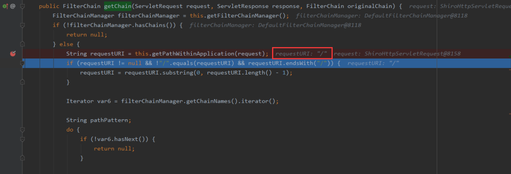

# Apache Shiro身份验证绕过漏洞（CVE-2020-11989）

编辑：r4v3zn

分析作者：淚笑、Ruilin

漏洞作者：淚笑

## Payload

`/ -> %2f ->%25%32%66`

```
GET /hello/a%25%32%66a HTTP/1.1
Host: 127.0.0.1:8080
User-Agent: Mozilla/5.0 (X11; Linux x86_64; rv:61.0) Gecko/20100101 Firefox/61.0
Accept: text/html,application/xhtml+xml,application/xml;q=0.9,*/*;q=0.8
Accept-Language: zh-CN,zh;q=0.8,zh-TW;q=0.7,zh-HK;q=0.5,en-US;q=0.3,en;q=0.2
Connection: close
Upgrade-Insecure-Requests: 1
```


`/;test/admin/page`


## 影响版本

- Apache Shiro < 1.5.3

## 分析过程

由于Shiro的权限校验是通过判断 URL 匹配来做的，如果能找到 Shiro 获取的 URL 与 Web 框架处理 URL 不一致的情况就能造成权限绕过。Shiro 中对于 URL 的获取及匹配在`org.apache.shiro.web.filter.mgt.PathMatchingFilterChainResolver#getChain`以访问 `/;/test/admin/page` 举例，通过 `getPathWithinApplication` 函数得到的路径为 `/` 



跟入该函数的处理逻辑 `org.apache.shiro.web.util.WebUtils#getPathWithinApplication`


可以看到 `org.apache.shiro.web.util.WebUtils#getRequestUri` 获取到的是 `/`

 

这里分别通过 ` getContextPath() getServletPath() getPathInfo() ` 获取并拼接得到 `/;/test//admin/page` ，传入后 `decodeAndCleanUriString` 变成了 `/` , `org.apache.shiro.web.util.WebUtils#decodeAndCleanUriString`


在 `decodeAndCleanUriString` ，会根据 Ascii 为 59 的字符也就是 `;` 进行 URL 的截断，所以最终返回了 `/` 

回到最开始的 `/;/test/admin/page` 请求，该 request 请求会进入 Spring 中， Spring 处理 URL 函数如下`org.springframework.web.util.UrlPathHelper#getPathWithinServletMapping `


在 `getPathWithinApplication` 处理下是能正确获取到 `context-path` 与路由，最终经过 `getPathWithinServletMapping` 函数格式化处理后，得到最终路径为 `/admin/page` ，所以我们可以正常访问到该页面


因此总结来说就是当 URL 进入到 Tomcat 时， Tomcat 判断 `/;test/admin/page` 为 `test` 应用下的 `/admin/page` 路由，进入到 Shiro 时被 ; 截断被认作为 `/` ,再进入 Spring 时又被正确处理为 `test` 应用下的 `/admin/page` 路由，最后导致 Shiro 的权限绕过。

## 靶场

靶场环境：`docker pull vulfocus/shiro-cve_2020_11989:latest`

## 修复

升级至最新版本：http://shiro.apache.org/download.html

## 分析文章

- [Apache Shiro 身份验证绕过漏洞 (CVE-2020-11989)](https://xlab.tencent.com/cn/2020/06/30/xlab-20-002/) Ruilin
- [Apache Shiro权限绕过漏洞分析(CVE-2020-11989)](https://mp.weixin.qq.com/s/yb6Tb7zSTKKmBlcNVz0MBA) 淚笑